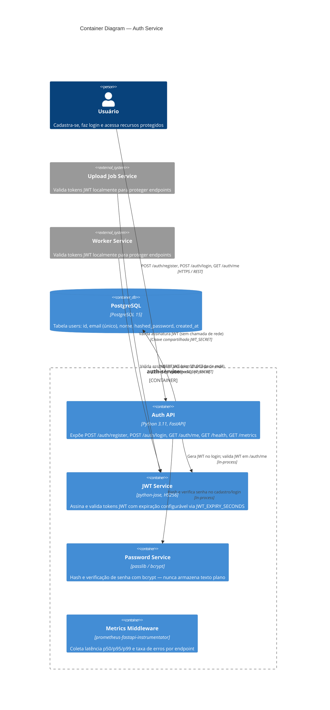

# C4 Container Diagram — Auth Service

**Nível**: Container (C4 Nível 2)  
**Serviço**: `auth-service`  
**Atualizado**: 2026-03-13

---

---

## Elementos

| Elemento | Tipo | Tecnologia | Responsabilidade |
|----------|------|-----------|-----------------|
| Auth API | Container | FastAPI | Endpoints de registro, login, /me, health, metrics |
| JWT Service | Container | python-jose | Geração e validação de tokens HS256 |
| Password Service | Container | passlib/bcrypt | Hash bcrypt; rejeita texto plano |
| Metrics Middleware | Container | prometheus-fastapi-instrumentator | `/metrics` com latência e taxa de erros |
| PostgreSQL | ContainerDb | PostgreSQL 15 | Fonte de verdade para identidades de usuário |

## Decisões de design

- Outros serviços validam JWT **localmente** (sem chamada de rede ao auth-service) — escalabilidade horizontal sem ponto único de falha na validação
- Migrations Alembic executadas automaticamente na inicialização do container
- E-mail inválido e senha incorreta retornam o mesmo `401` para evitar enumeração de usuários (RFC 6749)
