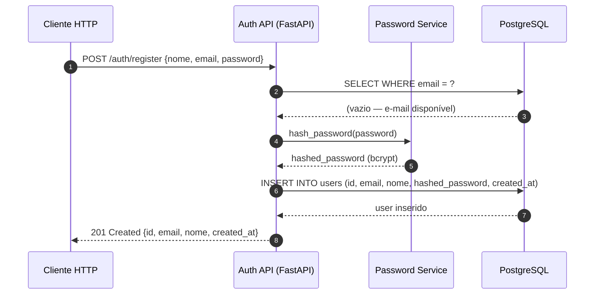
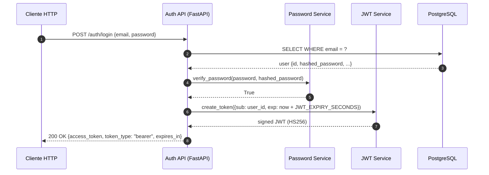
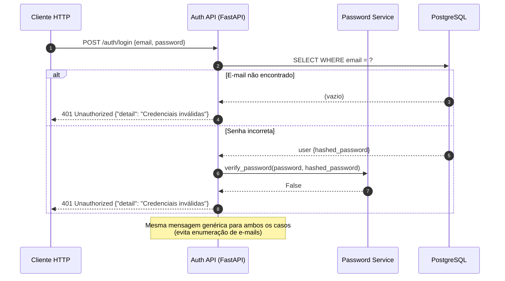
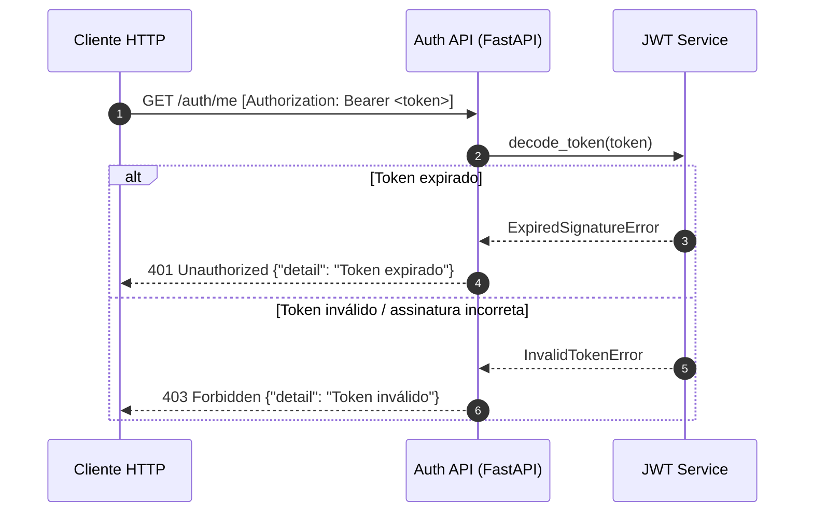

# Sequence Diagrams — Auth Service

**Serviço**: `auth-service`  
**Cobertura**: Happy path (US1 + US2) + erros críticos  
**Atualizado**: 2026-03-13

---

## Fluxo 1 — Happy Path: Cadastro de novo usuário (US1)

---

## Fluxo 2 — Happy Path: Login e obtenção de JWT (US2)

---

## Fluxo 3 — Erro: Credenciais inválidas

---

## Fluxo 4 — Erro: Token expirado ou inválido em endpoint protegido (US3)

---

## Resumo dos fluxos

| Fluxo | Trigger | Resultado final |
|-------|---------|----------------|
| Cadastro | POST /register com dados válidos | 201 + usuário criado |
| Login | POST /login com credenciais corretas | 200 + JWT |
| Credenciais inválidas | E-mail inexistente ou senha errada | 401 (mensagem genérica) |
| Token inválido/expirado | Bearer token ausente, expirado ou adulterado | 401/403 |
